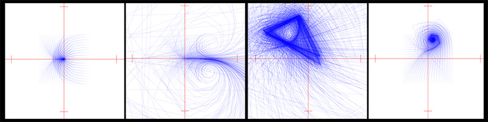

# The Doubling Map

This is some code related to the perturbed doubling map, a dynmical system I have been studying under the supervision of Professor Christian Wolf. 

## Test_Trajectories.pde

This visualization is meant to give a sense of the effect of adjusting the perturbation constant c on the map z -> z^2+c. By default, c is set to 0, so the first thing you see are the trajectories of a test mesh of points iterated 20 times, converging to the fixed point of the unperturbed map (which is the origin). 

Clicking anywhere on the plane sets the perturbation constant to the point clicked, recalculating the trajectories of the points in the test mesh. Notice that if you keep the perturbation constant relatively close to the origin, you retain convergence to some fixed point. Perturbations of higher magnitude cause fewer (if any) points to converge. 

The code can be run by downloading the .pde file and opening with the Processing environment, which can be dowmloaded at https://processing.org/

Alternately, the code can be compiled and run using the .java file, as long as you have the necessary libraries to import, which are included in the folder "lib."

## PeriodicPoints.ipynb

This code is written in Python in a Jupyter notebook. 

One aspect of the research I am doing involves looking at periodic points (and the associated measures) of the perturbed doubling map. The periodic points of the unperturbed map are straightforward to calculate, but even the smallest perturbation constant makes it very difficult to calculate periodic points very difficult. One computational way of approaching this is to identify the periodic points of the unperturbed map, and then "search" in a neighborhood of these points for the conjugate periodic points of the perturbed map. 

The first step in this process is to calculate some large number of periodic points of the unperturbed map. I did this and stored the set of points (and their orbits) in a pandas DataFrame, then did some filtering, etc, to remove duplicate orbits. I also identified Sturmian orbits (which are orbits when considered in the complex plane are entirely contained in a semi-circle), which are of particular interest in our research. 

Moving forward I will use these Sturmian periodic point to center a "search" for periodic points of the perturbed map, which because of conjugacy, we expect to be relatively "close" to the unperturbed orbits. 
