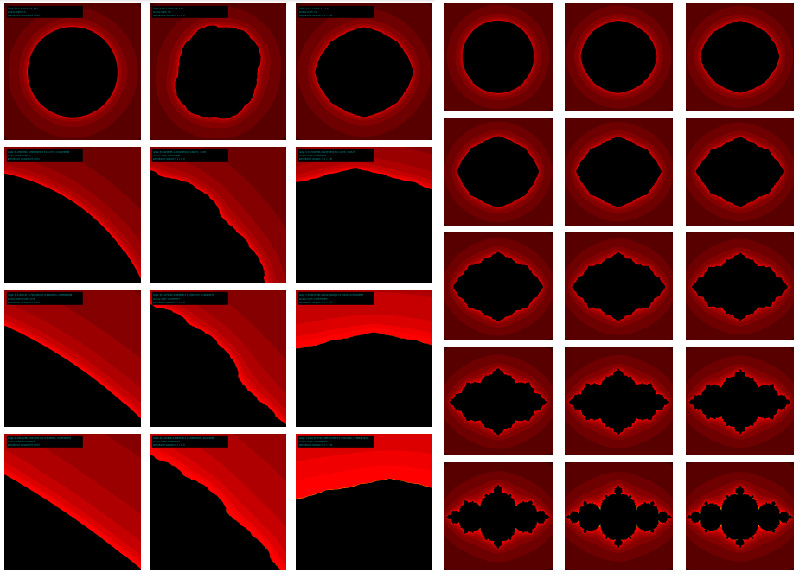

# The Doubling Map

This is some code related to the perturbed doubling map, a dynmical system I have been studying under the supervision of Professor Christian Wolf. 

## Point_Dynamics

The visualization is useful in getting a first sense of the dynamics of a map called the "perturbed doubling map"
where the point z (in the complex plane) is mapped to z^2 + c, where c is a complex number we call the 
"perturbation constant." 

Since there are a discrete number of sample points (the code right now draws and iterates 4000 points), after repeated
iteration, all points either shoot away into infinity (ie, away from the origin), or are "pulled into" the fixed point
of the sytem (if you chage the perturbation constant, the fixed point changes location) 

The visualization gives a sense of how the fixed point moves when we change the perturbation constant
and also the "pattern" of movement of points around the space as we continue to iterate the map. 
It also gives a sense of "how long" (in terms of number of iterations) until the system becomes stable
(ie, most points have either flown away to infinity or collapsed to the center). 

Also, it produces some nice patterns, that gives a sense of the regularity/periodicity of this kind of mapping. 

run the code using [processing](https://processing.org/). Click on the grid to iterate the map once. 

# How to interact with the program 

## Test_Trajectories.pde

This visualization is meant to give a sense of the effect of adjusting the perturbation constant c on the map z -> z^2+c. By default, c is set to 0, so the first thing you see are the trajectories of a test mesh of points iterated 20 times, converging to the attracting fixed point of the unperturbed map (which is the origin). 

Clicking anywhere on the plane sets the perturbation constant to the point clicked, recalculating the trajectories of the points in the test mesh. Notice that if you keep the perturbation constant relatively close to the origin, you retain convergence to some fixed point. Perturbations of higher magnitude cause fewer (if any) points to converge. 

The code can be run by downloading the .pde file and opening with the Processing environment, which can be dowmloaded at https://processing.org/

Alternately, the code can be compiled and run using the .java file, as long as you have the necessary libraries to import, which are included in the folder "lib."

## Julia_set_visualization.pde

Estimates and visualizes the julia set of the perturbed doubling map. Allows for zooming into the boundary of the Julia set (by draggin the mouse in a bounding box around the area to magnify) to observe the fractal structure. Perturbation constant is fixed, but can be adjusted in the first few lines of code (see comment in code). 

 

The code can be run by downloading the .pde file and opening with the Processing environment, which can be dowmloaded at https://processing.org/

## PeriodicPoints.ipynb

This code is written in Python in a Jupyter notebook. 

One aspect of the research I am doing involves looking at periodic points (and the associated measures) of the perturbed doubling map. The periodic points of the unperturbed map are straightforward to calculate, but even the smallest perturbation constant makes it very difficult to calculate periodic points explicitly. One computational way of approaching this is to identify the periodic points of the unperturbed map, and then "search" in a neighborhood of these points for the conjugate periodic points of the perturbed map. 

The first step in this process is to calculate some large number of periodic points of the unperturbed map. I did this and stored the set of points (and their orbits) in a pandas DataFrame, then did some filtering, etc, to remove duplicate orbits. I also identified Sturmian orbits (which are orbits when considered in the complex plane are entirely contained in a semi-circle), which are of particular interest in our research. 

I then use these Sturmian periodic points to center a "search" for periodic points of the perturbed map, which because of conjugacy, we expect to be relatively "close" to the unperturbed orbits. 
